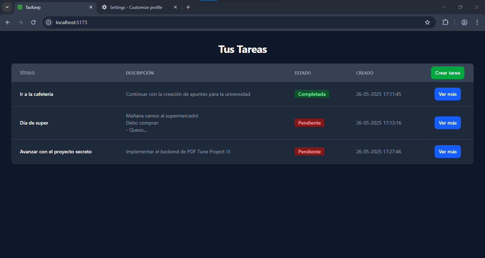

# TasKeep

Aplicación Web para crear, ver, modificar, y eliminar simples tareas.
Las sencillas tereas que maneja consisten en:
- Título: Algo que te ayude a indentificar tus tareas.
- Descripción: Todo el contenido importante de tu tarea.
- Estado:  Un indicador que te permite hacer seguimiento de tus tareas. Este puede ser **completada** o **pendiente**.

### Vista previa

## Instrucciones de ejecución (local)
Para poner en marcha la aplicación se necesita realizar los siguientes pasos:

### 1. Clonar el repositiorio
Usa el método de tu preferencia, pero siempre deberás clonar [este repositorio](https://github.com/alex-deev/forit-challenge-ingreso2025.git).

### 2. Intalación de dependencias
Una vez clonado el repositorio, deberás dirigirte a la carpeta donde lo descargaste.

Una vez allí, abre la carpeta **backend** una terminal y ejecuta el siguiente comando `npm install`. Luego ejecuta `npm run start`. Este ultimo ejecutará el servidor backend de forma local (si no se produce algún error).

De la misma forma, abre la carpeta **frontend** en otra terminal y ejecuta el comando `npm install`. Luego ejecuta `npm run build`, y después `npm run preview`. Estos comandos transpilarán y ejecutarán el servidor frontend para que puedas usar la app. En la consola aparecerán los links para abrir la aplicación web en el navegador, haz click en uno de ellos.

> Recuerda no cerrar las tarminales (donde se están ejecutando los servidores backend/fronted) mientras estés usando la aplicación, de lo contrarío dejará de funcionar.
> 

### 3. Listo! Usa la app

Esos son todos los pasos necesarios para ejecutar la apliación de forma local. Ya puedes usar TasKeep en tu navegador!

> ATENCIÓN \
> Debes tener previamente instalados `node` y `npm` en tu sistema.